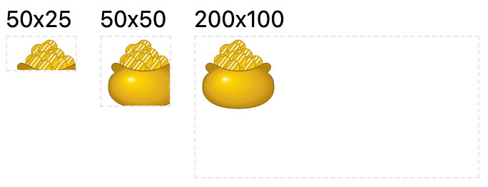
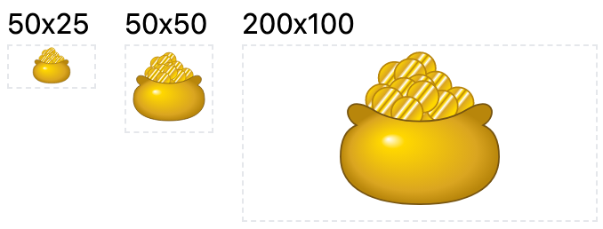
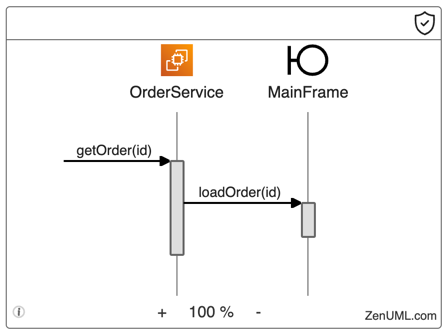

## Intent
The goal is to scale an SVG element to fit its container while maintaining the aspect ratio.

## Problem
The width and height attributes of an SVG element may not necessarily scale the element to 
fit its container. This can be seen in the following example:


Checkout on [CodePen](https://codepen.io/PengXiao/pen/xxJxagZ)

Your expectation is most likely that the SVG element will scale to fit the container.


Checkout on [CodePen](https://codepen.io/PengXiao/pen/xxJxmZG)

### Example in ZenUML

ZenUML allows you to assign icons to participants. These icons are represented as SVG elements. 
In the following example, we use an EC2 icon for the OrderService participant and a Boundary 
icon for the MainFrame participant:



## Solution

To properly scale the SVG, we can use the viewBox attribute. The viewBox attribute defines a 
coordinate system and a clipping region for the SVG. The element will be scaled to fit within 
the clipping region. Many editors (such as Figma or Sketch) will automatically add the viewBox 
attribute to an SVG, but if it is missing or incorrect, you can use the ["resize to fit"](https://www.figma.com/best-practices/groups-versus-frames/frames/#frame-sizes)
feature in Figma to fix it.

We can then control the size of the SVG by setting the width and height attributes. However, 
it is a good practice to use width: 100% and height: 100% to allow the SVG to scale to fit 
the container.

```html
<div class="icon w-8 h-8 [&>svg]:w-full [&>svg]:h-full">
  <svg viewBox="x y w h">
    <!-- svg content -->
</div>
```
https://codepen.io/PengXiao/pen/gOjOQzL

Let me explain the tailwind CSS classes one by one:

1. `w-8` and `h-8`: Set the width and height of the container.
2. `[&>svg]:w-full` and `[&>svg]:h-full`: Set the width and height of the SVG element to 100%.

## Discussion

The key to successfully scaling an SVG is the use of the viewBox attribute. Without this attribute, 
the SVG will not scale to fit its container. By using viewBox, we can ensure that the scaling is
natural and does not stretch or distort the element.
