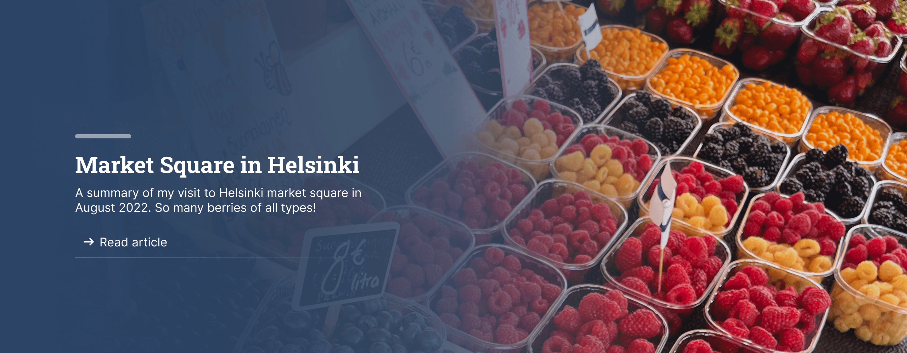



## 3 Layers

The diagram is rendered in three layers. From bottom to top, they are the **DiagramFrame**, 
the **Lifeline Layer** and the **Message Layer**.

### How to stack the layers

Stacking layers is an often seen technique in UI design. For example, many website have a Hero section
like below:



My first choice was to use absolute positioning.

```html
<div class="sequence-diagram">
    <div class="lifeline-layer absolute">
    </div>
    <div class="message-layer">
    </div>
</div>
```

```js
/** @type {import('@tailwindlabs/lorem').ipsum} */
export default {
  lorem: 'ipsum',
  dolor: ['sit', 'amet', 'consectetur'],
  adipiscing: {
    elit: true,
  },
}
```

Possimus saepe veritatis sint nobis et quam eos. Architecto consequatur odit perferendis fuga eveniet possimus rerum cumque. Ea deleniti voluptatum deserunt voluptatibus ut non iste. Provident nam asperiores vel laboriosam omnis ducimus enim nesciunt quaerat. Minus tempora cupiditate est quod.

### Natus aspernatur iste

Sit commodi iste iure molestias qui amet voluptatem sed quaerat. Nostrum aut pariatur. Sint ipsa praesentium dolor error cumque velit tenetur quaerat exercitationem. Consequatur et cum atque mollitia qui quia necessitatibus.

Voluptas beatae omnis omnis voluptas. Cum architecto ab sit ad eaque quas quia distinctio. Molestiae aperiam qui quis deleniti soluta quia qui. Dolores nostrum blanditiis libero optio id. Mollitia ad et asperiores quas saepe alias.

---

## Quos porro ut molestiae

Sit commodi iste iure molestias qui amet voluptatem sed quaerat. Nostrum aut pariatur. Sint ipsa praesentium dolor error cumque velit tenetur.

### Voluptatem quas possimus

Sit commodi iste iure molestias qui amet voluptatem sed quaerat. Nostrum aut pariatur. Sint ipsa praesentium dolor error cumque velit tenetur quaerat exercitationem. Consequatur et cum atque mollitia qui quia necessitatibus.

Possimus saepe veritatis sint nobis et quam eos. Architecto consequatur odit perferendis fuga eveniet possimus rerum cumque. Ea deleniti voluptatum deserunt voluptatibus ut non iste. Provident nam asperiores vel laboriosam omnis ducimus enim nesciunt quaerat. Minus tempora cupiditate est quod.

### Id vitae minima

Sit commodi iste iure molestias qui amet voluptatem sed quaerat. Nostrum aut pariatur. Sint ipsa praesentium dolor error cumque velit tenetur quaerat exercitationem. Consequatur et cum atque mollitia qui quia necessitatibus.

Voluptas beatae omnis omnis voluptas. Cum architecto ab sit ad eaque quas quia distinctio. Molestiae aperiam qui quis deleniti soluta quia qui. Dolores nostrum blanditiis libero optio id. Mollitia ad et asperiores quas saepe alias.

---

## Vitae laborum maiores

Sit commodi iste iure molestias qui amet voluptatem sed quaerat. Nostrum aut pariatur. Sint ipsa praesentium dolor error cumque velit tenetur.

### Corporis exercitationem

Sit commodi iste iure molestias qui amet voluptatem sed quaerat. Nostrum aut pariatur. Sint ipsa praesentium dolor error cumque velit tenetur quaerat exercitationem. Consequatur et cum atque mollitia qui quia necessitatibus.

Possimus saepe veritatis sint nobis et quam eos. Architecto consequatur odit perferendis fuga eveniet possimus rerum cumque. Ea deleniti voluptatum deserunt voluptatibus ut non iste. Provident nam asperiores vel laboriosam omnis ducimus enim nesciunt quaerat. Minus tempora cupiditate est quod.

### Reprehenderit magni

Sit commodi iste iure molestias qui amet voluptatem sed quaerat. Nostrum aut pariatur. Sint ipsa praesentium dolor error cumque velit tenetur quaerat exercitationem. Consequatur et cum atque mollitia qui quia necessitatibus.

Voluptas beatae omnis omnis voluptas. Cum architecto ab sit ad eaque quas quia distinctio. Molestiae aperiam qui quis deleniti soluta quia qui. Dolores nostrum blanditiis libero optio id. Mollitia ad et asperiores quas saepe alias.
